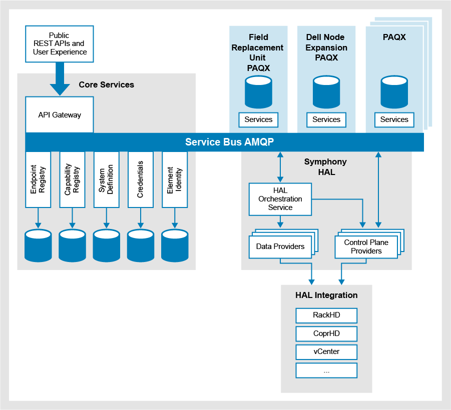

System architecture
===================

The system architecture consists of five key sections:

+----------------------------------------------+-----------------------------------------------------------------------------------------------------------+
|Section                                       |Desciption                                                                                                 | 
+==============================================+===========================================================================================================+
| Service Bus AMQP                             |The mechanism through which all individual components in Project Symphony communicate. The Service Bus     |
|                                              |AMQP is an instance of RabbitMQ, an open source implementation of an AMQP message broker. RabbitMQ is      |
|                                              |distributed by Pivotal under the Mozilla Public License.                                                   |
+----------------------------------------------+-----------------------------------------------------------------------------------------------------------+
|Symphony HAL and HAL Integration              |Provides a hardware abstraction layer between Project Symphony and the component element managers in a     |
|                                              |Dell EMC Converged System.                                                                                 |
+----------------------------------------------+-----------------------------------------------------------------------------------------------------------+
|Portable, Autonomous Query Execution (PAQX)   |Allows the installation of features in a common, repeatable way. By extracting a common installation       |
|                                              |framework, PAQX developers define aspects of their PAQX in a portable definition language. The PAQX        |
|                                              |framework uses this information to perform the required installation tasks, allowing PAQX developers to    |
|                                              |focus on implementing a feature instead of the installation process.                                       |
+----------------------------------------------+-----------------------------------------------------------------------------------------------------------+
|Core Services                                 |Provides credentials for the element managers and components, as well as the configuration specifications  |
|                                              |used to describe the components in a Converged System. Core services also include a registry of business   |
|                                              |capabilities so additional PAQX can be deployed and consumed without restarting.                           |                  
+----------------------------------------------+-----------------------------------------------------------------------------------------------------------+
|Core Services API Gateway                     |Used for REST-based communication implementing Zuul and Consul to act as a single entry point for all      |
|                                              |clients. The API gateway handles requests by either:                                                       |
|                                              |* Proxying or routing to the appropriate service, or                                                       |
|                                              |* Orchestrating requests to the required services.                                                         |
+----------------------------------------------+-----------------------------------------------------------------------------------------------------------+

Core services breakdown
-----------------------

+---------------------+-------------------------------------------------------------------------------------------------------------------------------------------------------------------------------------------------------------------------------------------------------------------------------+
|Core Service         |Description                                                                                                                                                                                                                                                                    |
+=====================+===============================================================================================================================================================================================================================================================================+
|Endpoint registry    |Provides the ability to register new endpoints for software that can provide core functionality and/or data to the system. The endpoint registry is the repository of applications that the Converged System can leverage, for example, RackHD, CoprHD, VMware vCenter Server. |
+---------------------+-------------------------------------------------------------------------------------------------------------------------------------------------------------------------------------------------------------------------------------------------------------------------------+
|Capability registry  |Provides the ability to dynamically register and look up new business capabilities. The capability registry is the repository of functionality that the system can provide, for example, installing ESXi.                                                                      |
+---------------------+-------------------------------------------------------------------------------------------------------------------------------------------------------------------------------------------------------------------------------------------------------------------------------+
|System definition    |Allows storage, retrieval, and querying of Converged Systems and system components.                                                                                                                                                                                            |
+---------------------+-------------------------------------------------------------------------------------------------------------------------------------------------------------------------------------------------------------------------------------------------------------------------------+
|Credentials          |A secure repository of component and endpoint credentials. When HAL or PAQX request component credentials, the credentials are supplied in an encrypted format.                                                                                                                |
+---------------------+-------------------------------------------------------------------------------------------------------------------------------------------------------------------------------------------------------------------------------------------------------------------------------+

PAQX 
-------

A PAQX defines a business capability that is available through the API Gateway, It is not required to have a public REST API. PAQX contracts are defined in a language-agnostic manner as `JSON <http://json-schema.org/>`_ schemas and can be implemented by third-party developers without dependency on Dell EMC software engineering. A PAQX can subscribe to events from other PAQX.

Field Replacement Unit (FRU) PAQX
~~~~~~~~~~~~~~~~~~~~~~~~~~~~~~~~~

Automates the process of replacing a node (a server with integrated storage mounted into a cabinet) in an operating Dell EMC VxRack FLEX System. It uses industry standard approaches to vacate existing VMs running on the node. It eliminates the node from any storage environment and then replicates the configuration onto the replacement node, re-using existing identifiers such as IP addresses.

Dell Node Expansion PAQX 
~~~~~~~~~~~~~~~~~~~~~~~~

Automates the process of deploying a new node that has been installed into the cabinet of an already operating VxRack FLEX System. It automates the expansion of the system and its available resources.

